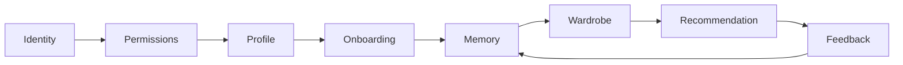

# IVEE / Sapphire Architecture

The current source of truth is now split by responsibility:

- [docs/IVEE_CONSTITUTION.md](docs/IVEE_CONSTITUTION.md): what IVEE protects
- [docs/IVEE_OS_SPEC.md](docs/IVEE_OS_SPEC.md): what IVEE OS is
- [docs/IVEE_ARCHITECTURE_BIBLE.md](docs/IVEE_ARCHITECTURE_BIBLE.md): how the platform should be built
- [docs/SAPPHIRE_PRODUCT_BRIEF.md](docs/SAPPHIRE_PRODUCT_BRIEF.md): what Sapphire is as Product 001
- [docs/MASTER_BUILD_BLUEPRINT.md](docs/MASTER_BUILD_BLUEPRINT.md): original MVP build plan

## Current MVP

Sapphire is a Next.js + Supabase MVP with:

- Public landing page
- Signup and login pages
- Style quiz
- Dashboard
- Community page
- Initial Supabase schema
- Mock recommendation API

## Brand And Platform Separation

```text
IVEE
  IVEE OS
  Sapphire
  IVEE Business
  IVEE Studio
  IVEE Creator
  IVEE AI
  IVEE Trust
  IVEE Cloud
```

IVEE is the company.

IVEE OS is the identity, permission, memory, context, trust, and decision platform.

Sapphire is the first consumer application built on IVEE OS.

## Target Architecture

The first production-ready architecture should focus on one platform-validating loop:



## Platform Engines

| Engine | Responsibility |
| --- | --- |
| Identity Engine | Users, profiles, organizations, agents, and object identities. |
| Permission Engine | Grants, revocations, scopes, and access checks. |
| Trust Engine | Privacy, transparency, audit, recovery, and safety controls. |
| Event Engine | Immutable history for important platform actions. |
| Memory Engine | User-controlled retained knowledge and correction flows. |
| Knowledge Graph Engine | Relationships between identities, objects, contexts, memories, and events. |
| Decision Engine | Explainable decisions from rules, memory, graph signals, context, and AI. |
| Recommendation Engine | Candidate generation, ranking, explanations, and outcomes. |
| Search Engine | Permissioned search across products, outfits, content, and memories. |

## Next Engineering Priority

Milestone 1 is Phase 0 platform foundation:

1. Align database schema with identity, permissions, privacy, audit, memory, wardrobe, and recommendation runs.
2. Implement real session handling and dashboard protection.
3. Save onboarding answers as profile data and memory events.
4. Create a wardrobe item model.
5. Generate explainable recommendation runs from stored profile and wardrobe context.
6. Record feedback as memory.
7. Add a trust activity surface for permissions, events, and data controls.
