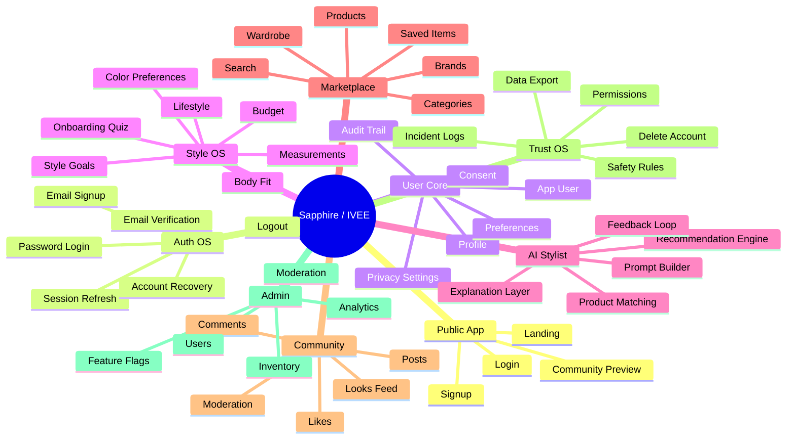
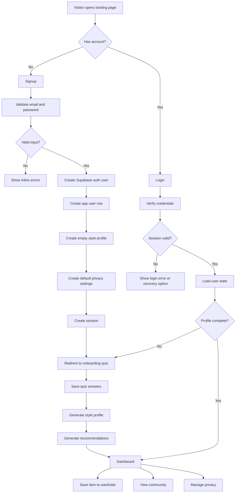
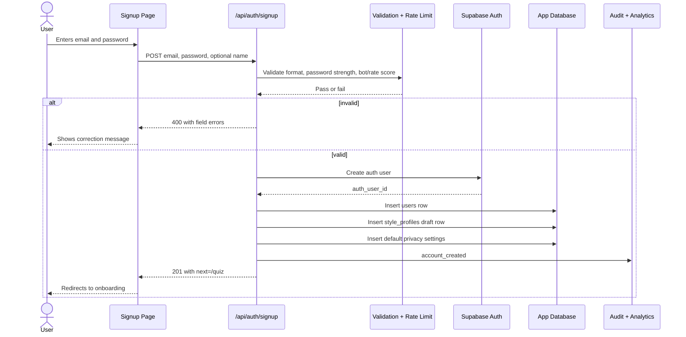
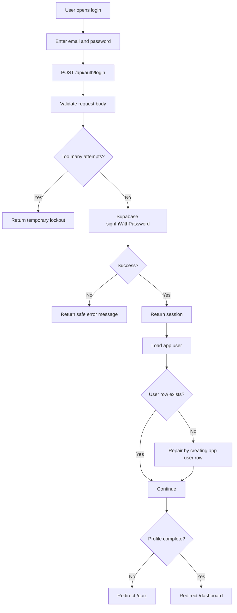
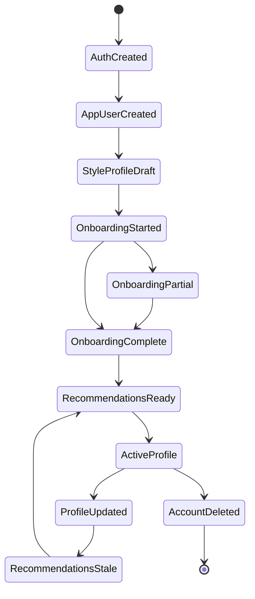
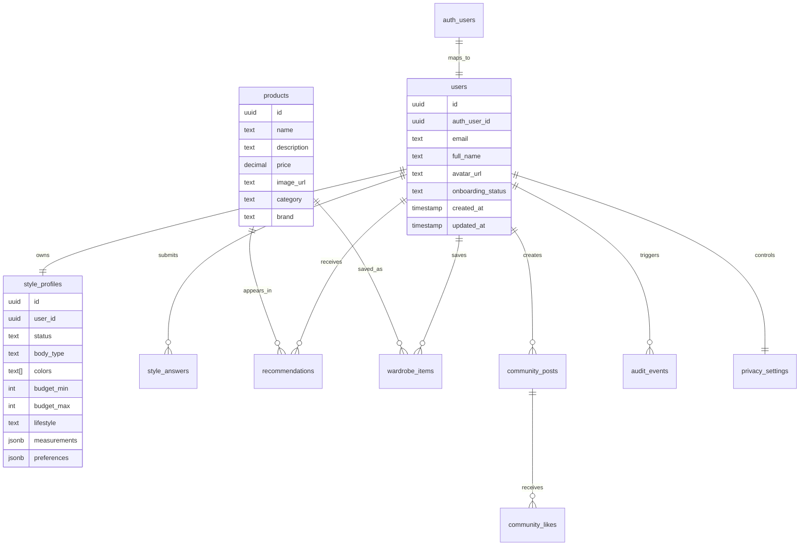

# Sapphire / IVEE Master Build Blueprint

Status: build specification v0.1  
Goal: turn the current MVP into an engineering-ready product architecture.

## 0. Current Source Of Truth

This blueprint is preserved as the original MVP build plan. The platform direction has since been split into more durable documents:

- [IVEE Constitution](IVEE_CONSTITUTION.md): company and platform laws.
- [IVEE Operating System Specification](IVEE_OS_SPEC.md): conceptual OS model.
- [IVEE Architecture Bible](IVEE_ARCHITECTURE_BIBLE.md): engineering architecture direction.
- [Sapphire Product Brief](SAPPHIRE_PRODUCT_BRIEF.md): consumer product positioning.

Current brand architecture:

```text
IVEE -> IVEE OS -> Sapphire
```

IVEE is the company. IVEE OS is the platform. Sapphire is the first consumer application.

## 1. Full Rating

| Category | Rating | Current State | What Makes It Stronger |
| --- | ---: | --- | --- |
| Vision | 10/10 | Clear lifestyle OS ambition with a strong emotional hook. | Keep the big ecosystem, but ship one narrow vertical slice first. |
| Brand Direction | 9/10 | The AI stylist and private community idea is memorable. | Define exact voice, visual rules, and trust promises. |
| Current UI | 7/10 | Home, signup, login, quiz, dashboard, and community are present. | Replace placeholder gradients/cards with real product and outfit assets. |
| Current UX | 6/10 | Main screens exist, but the flows are not connected deeply yet. | Add real session handling, onboarding states, empty states, errors, and redirects. |
| Auth Readiness | 5/10 | Signup/login API routes exist with Supabase. | Add validation, profile creation, email verification, rate limiting, and audit events. |
| Profile System | 4/10 | Database has `users` and `style_profiles`. | Create explicit profile lifecycle: draft, onboarding, complete, stale, archived. |
| Recommendation System | 4/10 | Mock recommendations exist. | Save quiz answers, call AI/search logic, store recommendations, collect feedback. |
| Database Design | 5/10 | Useful initial schema. | Add auth mapping, consent, sessions/audit logs, preferences, wardrobe, saved items, and events. |
| Security | 5/10 | RLS is started. | Fix auth/user ID mapping, validate API inputs, avoid service-role misuse, add threat model. |
| Engineering Readiness | 5/10 | The repo is buildable in concept. | Add architecture docs, typed contracts, schemas, tests, and milestone issues. |
| Scalability | 7/10 | Supabase + Next is fine for an MVP. | Split reusable domains only after core flows are real. |
| Overall | 7.0/10 now, 9.2/10 vision | Strong concept with prototype foundations. | Needs product architecture and stateful flows before feature expansion. |

Verdict: the idea is strong enough to build, but the current repo is still a prototype. The next goal is not "add 100 features." The next goal is to make signup, signin, profile creation, onboarding, and recommendations feel real end to end.

## 2. First Build Wedge

Build this before anything else:

1. User lands on Sapphire.
2. User signs up.
3. System creates auth account and app user profile.
4. User completes onboarding/profile quiz.
5. System stores profile preferences.
6. System generates recommendations.
7. User saves items to wardrobe.
8. User can return later and continue from the correct state.

This is the first product loop.

## 3. Product Tree



## 4. End-to-End User Flow



## 5. Signup Flow



Required signup rules:

| Step | Rule |
| --- | --- |
| Input | Email required, password required, name optional in v1. |
| Validation | Use Zod in API route and client form. |
| Rate limit | Limit attempts by IP and email. |
| Auth creation | Use Supabase Auth as source of truth for credentials. |
| App profile | Create `users` row immediately after auth creation. |
| Style profile | Create draft `style_profiles` row immediately. |
| Privacy | Create default privacy/consent record immediately. |
| Redirect | New users go to `/quiz`, not `/dashboard`. |
| Logging | Store audit event for account creation. |

## 6. Signin Flow



Required signin states:

| State | UX |
| --- | --- |
| Wrong password | Friendly generic error. |
| Unknown email | Same generic error to avoid account discovery. |
| Unverified email | Prompt to resend verification. |
| Existing session | Redirect to dashboard or quiz based on profile status. |
| Missing app profile | Repair automatically and log `profile_repaired`. |

## 7. Profile Creation Flow



Profile statuses:

| Status | Meaning | Next Screen |
| --- | --- | --- |
| `draft` | Account exists, quiz not started. | `/quiz` |
| `onboarding` | Quiz started but not finished. | `/quiz?resume=1` |
| `complete` | Enough data for recommendations. | `/dashboard` |
| `stale` | User changed preferences; recommendations need refresh. | `/dashboard?refresh=1` |
| `archived` | Account deleted or disabled. | Login blocked |

## 8. Data Tree



## 9. MVP Routes

| Route | Purpose | Build Status |
| --- | --- | --- |
| `/` | Public landing page | Exists, needs polish |
| `/signup` | Create account | Exists, needs real state handling |
| `/login` | Sign in | Exists, needs session persistence |
| `/quiz` | Build style profile | Exists, does not save answers yet |
| `/dashboard` | Recommendations, community, achievements | Exists, mostly mock UI |
| `/community` | Public/community looks | Exists, mostly mock UI |
| `/privacy` | Trust dashboard | Missing |
| `/wardrobe` | Saved items | Missing |
| `/profile` | User settings and preferences | Missing |
| `/admin` | Manage products/moderation | Missing |

## 10. API Contract Plan

| Endpoint | Method | Purpose |
| --- | --- | --- |
| `/api/auth/signup` | POST | Create auth user, app user, draft profile, default privacy settings. |
| `/api/auth/login` | POST | Sign in and return next route based on profile status. |
| `/api/auth/logout` | POST | End session. |
| `/api/profile/me` | GET | Return current user, profile, privacy settings, onboarding status. |
| `/api/profile/update` | PATCH | Update profile fields and mark recommendations stale. |
| `/api/onboarding/save` | POST | Save quiz answer batch or partial progress. |
| `/api/onboarding/complete` | POST | Validate quiz, finalize profile, generate initial recommendations. |
| `/api/recommendations/generate` | POST | Generate recommendations from profile and product catalog. |
| `/api/recommendations/list` | GET | Return stored recommendations. |
| `/api/wardrobe/save` | POST | Save product/recommendation to wardrobe. |
| `/api/community/feed` | GET | List public posts. |
| `/api/privacy/settings` | GET/PATCH | Read and update privacy controls. |

## 11. Recommended Repo Tree

```text
sapphire-mvp/
  docs/
    MASTER_BUILD_BLUEPRINT.md
    SECURITY_MODEL.md
    API_CONTRACTS.md
    DATABASE_MODEL.md
    UX_FLOWS.md
  src/
    app/
      page.tsx
      signup/page.tsx
      login/page.tsx
      quiz/page.tsx
      dashboard/page.tsx
      profile/page.tsx
      privacy/page.tsx
      wardrobe/page.tsx
    pages/api/
      auth/
      profile/
      onboarding/
      recommendations/
      wardrobe/
      privacy/
    lib/
      supabase/
      validation/
      auth/
      audit/
      recommendations/
    components/
      ui/
      auth/
      dashboard/
      onboarding/
  supabase/
    migrations/
```

## 12. Build Milestones

### Milestone 1: Auth + Profile Foundation

Definition of done:

1. Signup validates input.
2. Signup creates Supabase Auth user.
3. Signup creates app `users` row.
4. Signup creates draft `style_profiles` row.
5. Login returns a `next` route.
6. Dashboard blocks unauthenticated access.
7. New users land on quiz.

### Milestone 2: Real Onboarding

Definition of done:

1. Quiz saves answers.
2. User can refresh without losing progress.
3. Profile status moves from `draft` to `onboarding` to `complete`.
4. Measurements/preferences are structured.
5. Completion triggers recommendation generation.

### Milestone 3: Recommendation Loop

Definition of done:

1. Product seed data exists.
2. Recommendation API uses profile data.
3. Recommendations are saved to the database.
4. User can like/dislike/save recommendations.
5. Feedback improves later recommendations.

### Milestone 4: Wardrobe + Privacy

Definition of done:

1. User can save items to wardrobe.
2. User can remove saved items.
3. Privacy dashboard shows stored data.
4. User can export/delete account data.
5. Audit events exist for sensitive changes.

## 13. Immediate Codex Build Tasks

Do these next, in this order:

1. Add shared Supabase client helpers.
2. Add Zod schemas for signup, login, onboarding, and profile update.
3. Fix database schema so `users.id` maps safely to Supabase auth.
4. Update signup API to create user/profile/privacy rows in one flow.
5. Update login API to return `{ session, next }`.
6. Update signup/login pages to show real API errors.
7. Make quiz save onboarding progress.
8. Make dashboard load real profile/recommendation state.
9. Add privacy dashboard.
10. Add wardrobe save/list APIs.

## 14. CTO Rating After This Blueprint

With this document in place, the project moves from:

Prototype readiness: 5/10  
Build readiness: 7/10  

After Milestone 1 is implemented:

Prototype readiness: 7.5/10  
Build readiness: 8/10  

After Milestone 3 is implemented:

Prototype readiness: 9/10  
Build readiness: 8.8/10  

The idea can become a 20/10 only when the product is no longer just beautiful screens, but a living system where auth, profiles, AI, trust, and recommendations all talk to each other cleanly.
